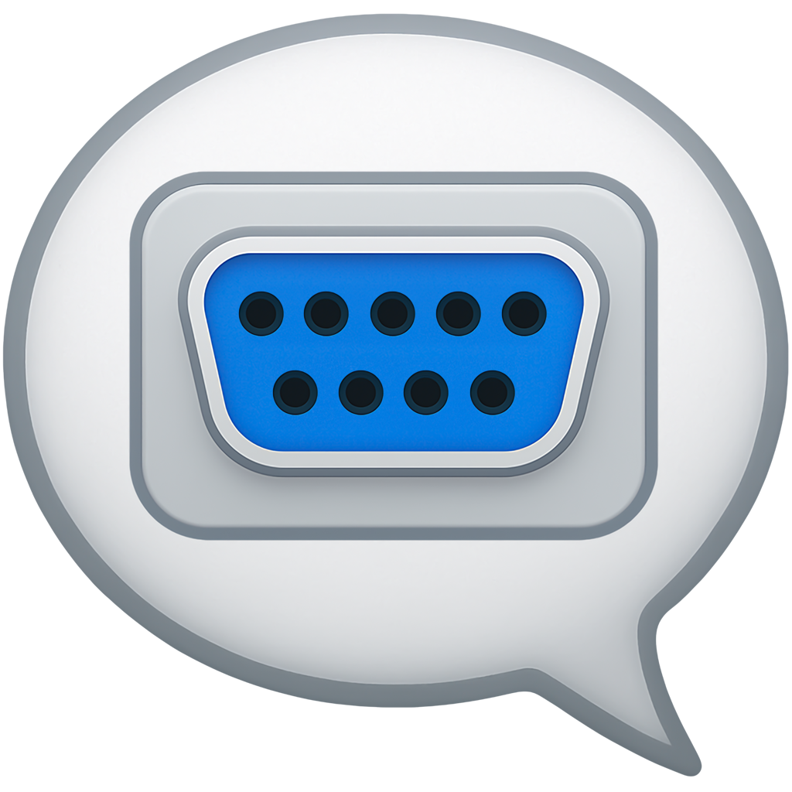
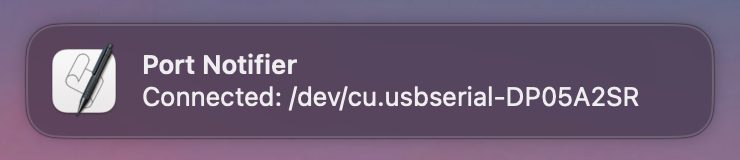
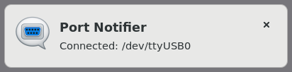
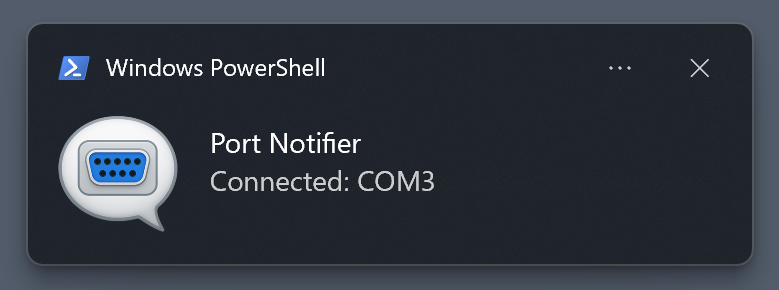

<div align="center">
  <p></p>
  <h1>Port Notifier</h1>
  Get notified when a TTY (COM) port connects or disconnects. Inspired by <a href="https://github.com/tomozh/PortPop">tomozh/PortPop</a>.
</div>

# Supported platforms

- macOS (tested)
- Linux (tested with GNOME Flashback, others are untested)
- Windows (tested)
- Other Unix-like platforms (untested)

|   Platform    |                             Screenshot                              |
|:-------------:|:-------------------------------------------------------------------:|
|     macOS     |          |
| Linux (GNOME) |  |
|    Windows    |      |


# Install

1. Download the latest executable.

   - macOS [amd64](https://github.com/puhitaku/port-notifier/releases/latest/download/port-notifier-darwin-amd64) /
           [arm64](https://github.com/puhitaku/port-notifier/releases/latest/download/port-notifier-darwin-arm64)
   - Linux [amd64](https://github.com/puhitaku/port-notifier/releases/latest/download/port-notifier-linux-amd64) /
           [arm](https://github.com/puhitaku/port-notifier/releases/latest/download/port-notifier-linux-arm) /
           [arm64](https://github.com/puhitaku/port-notifier/releases/latest/download/port-notifier-linux-arm64) /
           [riscv64](https://github.com/puhitaku/port-notifier/releases/latest/download/port-notifier-linux-riscv64) /
           [mipsle](https://github.com/puhitaku/port-notifier/releases/latest/download/port-notifier-linux-mipsle) /
           [mips64le](https://github.com/puhitaku/port-notifier/releases/latest/download/port-notifier-linux-mips64le)
   - Windows [amd64](https://github.com/puhitaku/port-notifier/releases/latest/download/port-notifier-windows-amd64.exe) /
             [arm64](https://github.com/puhitaku/port-notifier/releases/latest/download/port-notifier-windows-arm64.exe)

> [!IMPORTANT]
> On Windows, double-clicking the exe will start Port Notifier, but nothing will show up. The reason is in the [Caveats](#caveats) section.
> Please use Task Manager to check or kill the process.

1. Only on Unix-like platforms: make it executable.

   ```
   $ chmod +x port-notifier-darwin-arm64  # example for macOS
   ```

1. Optional: edit config.toml.

   Config search paths: `${PWD}/config.toml`, `~/.config/port-notifier/config.toml`

   Use the pre-generated config.toml in the repository or generate it yourself with the `-g` option.

   ```
   $ ./port-notifier-darwin-arm64 -g
   ```

1. Optional: register the executable to run automatically at startup.

1. Run it.


# Config file

```toml
# Title: the notification title.
Title = "Port Notifier"

# MessageOnConnection: format string of the connection's body.
# %s will be replaced by the TTY/COM port name.
MessageOnConnection = "Connected: %s"

# MessageOnDisconnection: format string of the disconnection notification's body.
# %s will be replaced by the TTY/COM port name.
MessageOnDisconnection = "Disconnected: %s"

# DetectConnection: true to notify connection events. false to disable it.
DetectConnection = true

# DetectDisconnection: true to notify disconnection events. false to disable it.
DetectDisconnection = true

# Verbose: enable debug log.
Verbose = false
```


# Caveats

- Port Notifier uses [gen2brain/beeep](https://github.com/gen2brain/beeep) as a notification backend. Some limitations originate from it.
- macOS: the notification icon will be osascript's icon.
- Linux: notification behavior varies depending on the desktop environment you use.
- Windows: the exe is linked with `-ldconfig "-H windowsgui"`. This means that no console will appear when the exe is launched. If you want to debug Port Notifier on Windows, please build it from the source code.